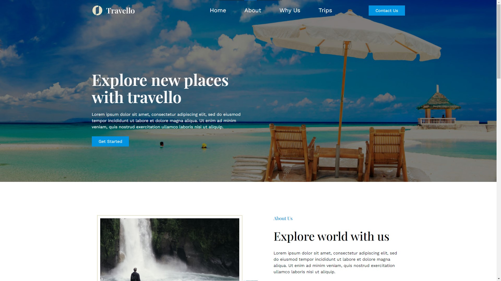
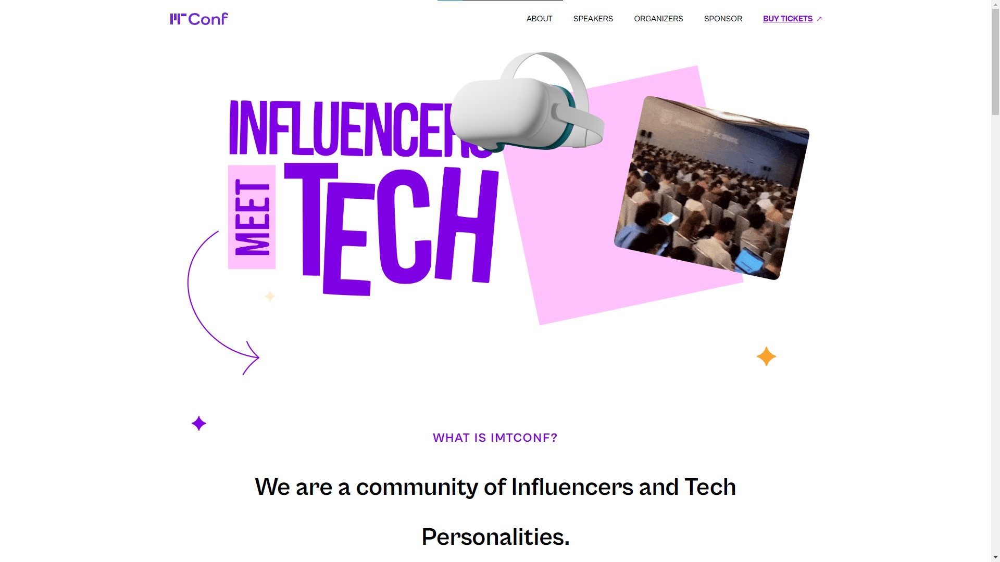
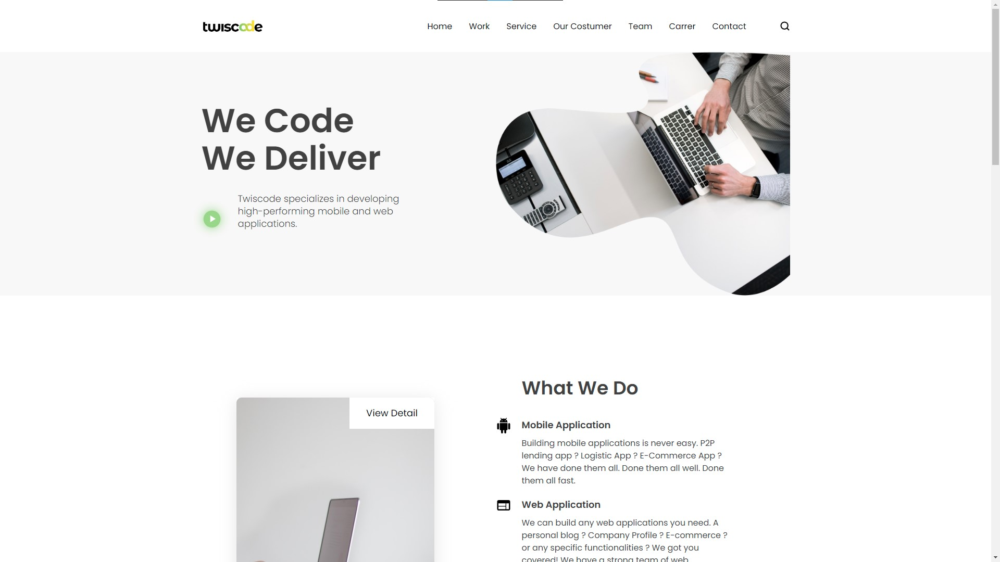

# Repositório dedicado à prática de desenvolvimento front-end com arquivos disponíveis no Figma.

Para ver os projetos ao vivo, clique [aqui](https://barbosadiego.github.io/figma-to-website/).

## Capturas de tela

